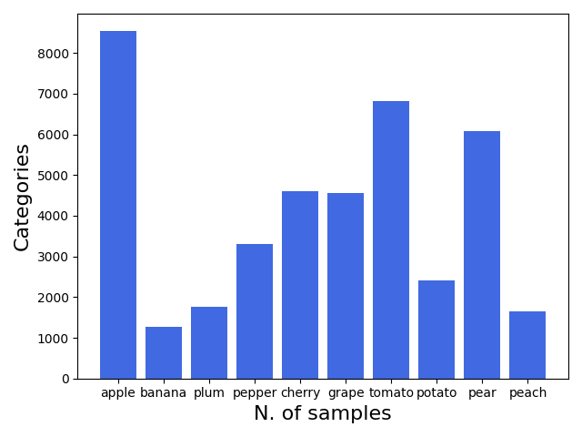
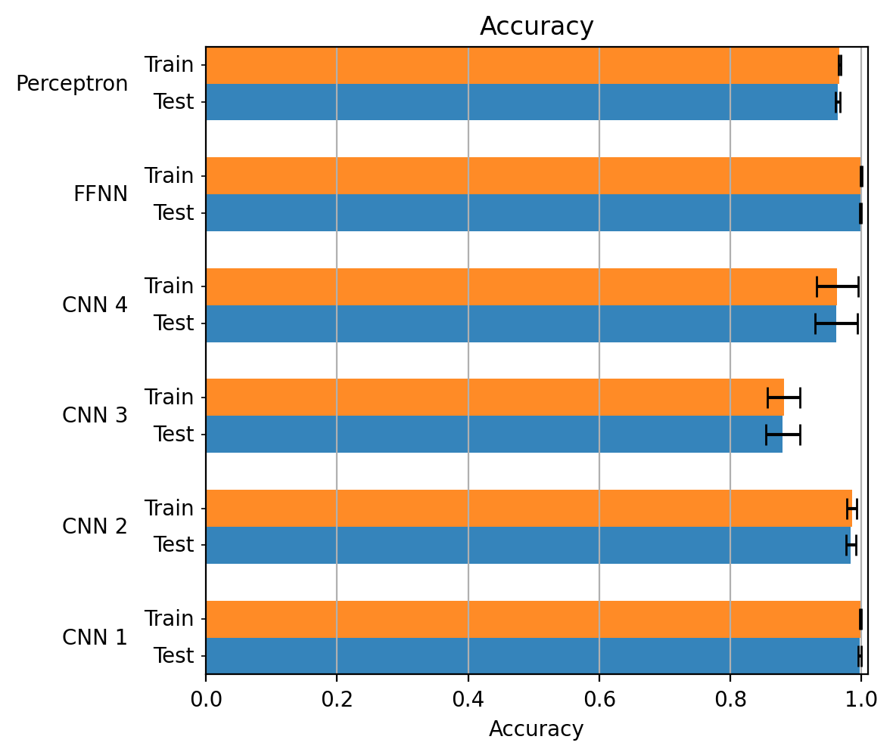
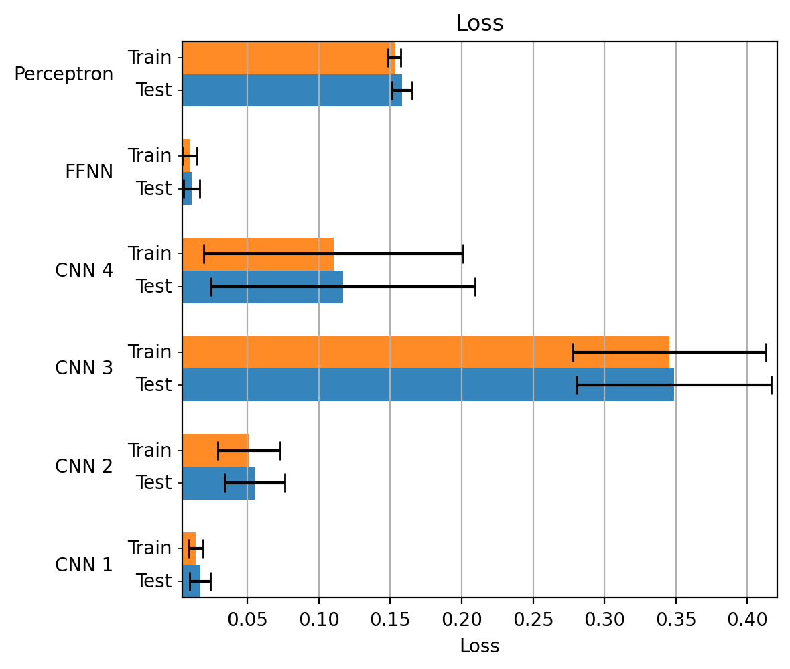
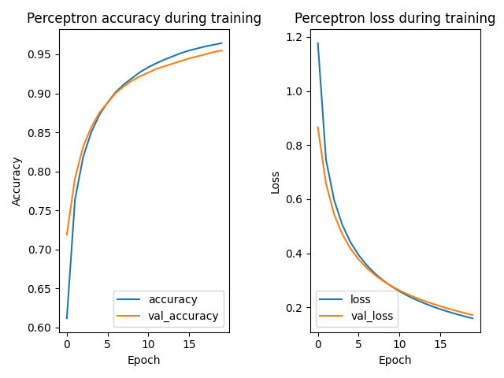
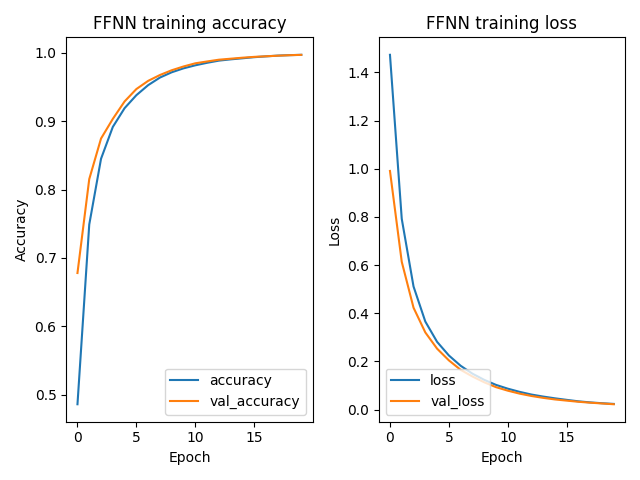
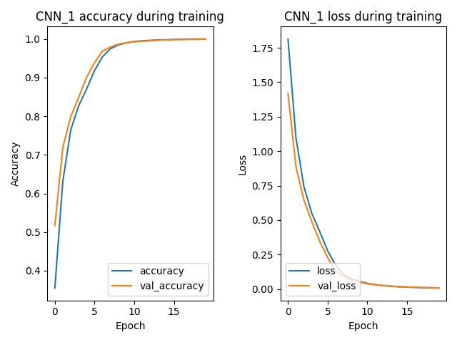
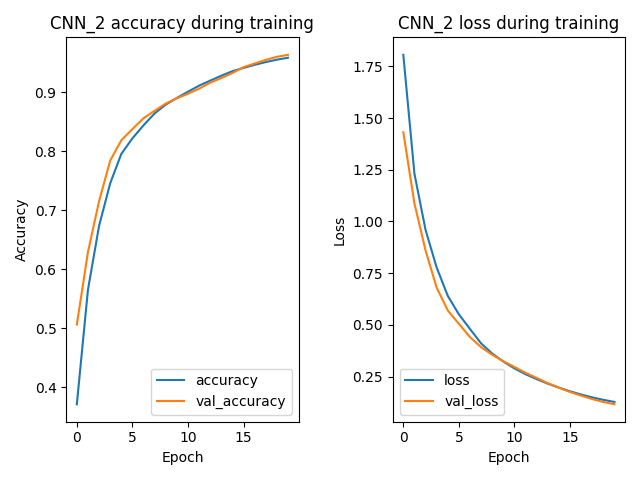
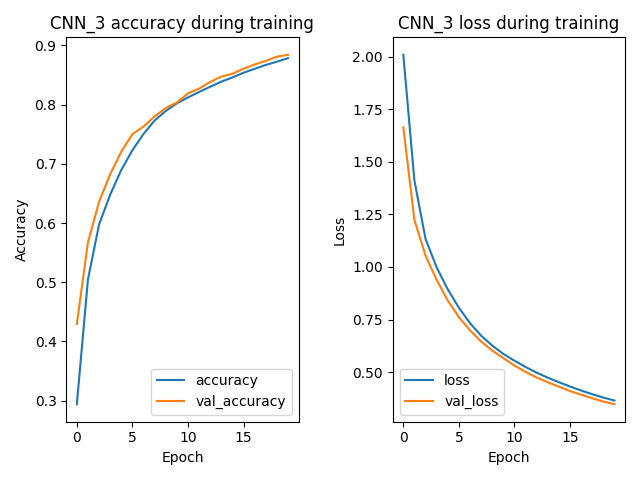
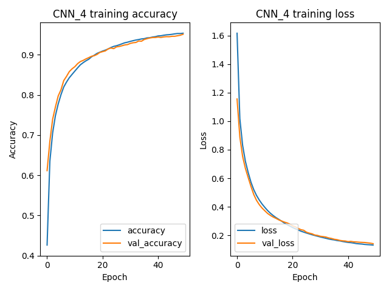

# Statistical Methods for Machine Learning
The code contained in this repository automatically downloads and organize the dataset, then in executes trains and evaluates the models and plots the relative graphs. The [dataset](https://www.kaggle.com/moltean/fruits) is hosted by [kaggle.com](https://www.kaggle.com/) and it is not included in this repo. Before execute the code, please configure the kaggle's API by the following steps:

* make sure to have Python 3 installed and correctly configured
* install the kaggle API typing in console ```pip3 install kaggle```
* register to the kaggle website
* go to your personal account page and click the button "Create New API Token"
* the file downloaded in the previous step contains the credentials to login to the kaggle website: do not share with anyone
* copy this file in the path ```/home/{username}/.kaggle```

Now, follow the next steps to run the program:

* install pip3 19.0 or later
* configure your system to use the GPU (this improves the performance of tensorflow)
* open a terminal in the project directory
* install dependencies typing ```pip3 install -r requirements.txt```
* finally, for starting the program, digit ```python3 -m machine_learning_project.run_pipeline```

The models results have already been calculated: they are saved in this repository, and the code simply loads them and plots the graphs.
If you want to recalculate the results, delete the folders ```machine_learning_project/experiments/results``` and ```machine_learning_project/experiments/plots``` and run the project. If the graphs are wrong, please rerun the code and check if they are fixed.

# Introduction

In the real world, there are a lot of different tasks that are too complicated to be modeled by a conventional algorithm. Some problems indeed may have a wide amount of data difficult to analyze. In this case, build a specific algorithm means to understand the complex patterns and the hidden correlations between the data. Instead, other tasks may be influenced by a lot of external factors that generate a large quantity of similar but different data. These factors are not easy to model, especially considered all together, and often they are not a priori known. This means that an algorithm performs well only in a controlled environment, that respects specific preconditions. On the other hand, if it is applied in the real world, the algorithm may encounter data that it cannot correctly analyze. A particular field of Computer Science is particularly suitable to solve these situations: machine learning (ML). It represents a family of algorithms that learn automatically through experience. These algorithms are not designed for a specific task but they are general purposes so they can be used to solve each type of task. The principle behind machine learning is the following: each real phenomenon can be modeled as an unknown mathematical function which can be approximate by a machine learning algorithm. In particular, they build a mathematical model based on sample data, known as training data, to make decisions or predictions without being explicitly programmed to do so. This means that the data play a central role in machine learning: they must be able to correctly define the model behind the task. First of all, they must be sufficient in number to generalize the problem, especially if the data have high dimensionality. Secondly, they must be well-formed, in terms of the range of values, scale, and distribution. Often a preprocessing procedure is necessary to modify the data before being used by a learning machine to improve its performance. There are three main approaches to machine learning, depending on the nature and the type of data available to a learning machine. The first is called *supervised learning* and consists in presenting to the learning model the inputs with the correct outputs. The goal is to learn a general function that maps inputs to outputs. Another machine learning technique is *unsupervised learning* where the input is not associated with labels, leaving to the learning machine the task of finding the data structure. Discovering the hidden patterns of data can be a goal itself or the purpose can be the generation of new data with similar characteristics. The last category is called *reinforcement learning* and occurs when a computer program interacts with a real environment in which it must perform a certain task. The leaning machine is provided by feedback which is analogous to rewards and it tries to maximize them, as it navigates the specific problem space. Machine learning algorithms are often used in computer vision tasks, like object classification, object detection, motion analysis, and many others. In the last few years, the state of the art methods to perform object classification use machine learning, in particular *deep learning.* Deep learning is based on artificial neural networks, inspired by the biological neural network that composed the animal brains. Specifically to computer vision, the convolutional neural networks (CNNs) are particularly suitable for analyzing images. They are able to learn how to extract the features using the convolutional layers and, subsequently, use these features in a space invariant way to better generalize the data. In this work, it is performed a multi-classification task over images. This task is performed using deep learning models. The aim is to study the neural network performances based on their type, their architecture, and their hyperparameters. In particular, the model tested is the feed-forward neural network (FFNN) and the convolutional neural network (CNN).

# Experimental setup

The aim of this project is to evaluate the performances of deep networks in an image multi-classification task. More in detail, it consists into map fruit and vegetable images over ten classes: *apple*, *banana*, *plum*, *pepper*, *cherry*, *grape*, *tomato*, *potato*, *pear*, and *peach*.

## Dataset

The dataset consists of a wide series of images that depict different types of fruit and vegetables. It is downloadable by following this [link](https://www.kaggle.com/moltean/fruits). The original dataset is already divided into training and test set. For each set, each type of fruit and vegetable is divided according to its main characteristics. For instance, the fruit type "apple" can be divided into a lot of sub-categories according to its variety (apple Golden, apple Granny Smith, apple Pink Lady, etc) and its color (yellow, red, green, etc). In the dataset, for each type-feature pair, there is a folder that contains the related pictures. The dataset is not used as is but it is modified and reorganize to perform the assigned task. First of all, the split between training and test set is removed in order to compose a single set of images. Secondly, the sub-types of fruit and vegetables are grouped together. This means that all apple sub-types belonging to the same class. Finally, only the 10 requested types of fruit and vegetables are considered(apple, banana, plum, pepper, cherry, grape, tomato, potato, pear, and peach), the others are removed. Now the dataset is composed of ten folders that contain the images relating to the ten classes. The figure below shows the ten classes.


To better understand how the dataset is composed, the following table and graphic show the number of samples for each class and the total amount of pictures

| **Class** | **N. of samples** |
| --------- | ----------------- |
| Apple     | 8538              |
| Banana    | 1258              |
| Cherry    | 4592              |
| Grape     | 4565              |
| Peach     | 1640              |
| Pear      | 6070              |
| Pepper    | 3304              |
| Plum      | 1766              |
| Potato    | 2404              |
| Peach     | 6810              |
| **Total** | **40947**         |



## Data preprocessing

The problem data (the images) have to be properly elaborated before being used by models. The data preprocessing phase aims to make the dataset easier to analyze, to increase the models' performance, and reduce the training time. The preprocessing pipeline, applied for each dataset picture, is composed of two steps:

- **scaling:** the image is resized form 100x100 pixels to 32x32 pixels using the bilinear interpolation algorithm
- **normalization:** the pixels RGB channel values, originally in the [0, 255] range, are standardized to be in the [0, 1] range.

## Experiments evaluation

After the preprocessing pipeline, the data are ready to pass to the learning models. Cross-validation is used to evaluate the models' performances, in particular the Hold-out technique. This method consists into split the dataset in two separate sets: the training set (used to train the leaning machines) and the test set (used to evaluate the models' performance). In this case, the split is 80% and 20% for training and test set. The union between them form an holdout. The experiments are executed over 20 different holdouts. The [method](https://scikit-learn.org/stable/modules/generated/sklearn.model_selection.StratifiedShuffleSplit.html) used to compute the holdouts is implemented in the sklearn library. This method randomly separates the training and test set indices, preserving the percentage of samples for each class. It is set with 42 as a random state parameter. To numerically evaluate the models the following metrics are used: 

- **loss function value**: the value of the model's loss function
- **accuracy:** the ration between the correct predictions and the total number of samples.

The final results are the mean and the standard deviation of the metrics obtained by the learning machines using each holdouts (both for training and validation phases). These results and the related conclusions are finally validated using the Wilcoxon signed-rank test with a p-value threshold of 0.01. It is a non-parametric statistical test to compare hypotheses made on repeated measures. In addiction, for each model, the trend of the metrics during the training phase are plotted to understand how the model learns during the succession of epochs. This is done only for the first holdout.

# Models

This section reports the architecture and the hyper-parameters of the neural networks used to classy the images. In particular, the model tested are feed-forward neural networks (FFNNs) and convolutional neural networks (CNNs). 

## Feed-forward neural network

The feed-forward neural network is the first and simplest type of artificial neural network. The information moves in only one direction, forward, from the input nodes, through the hidden nodes, and to the output nodes. The layers of neurons are fully connected, in the sense that each neuron of a layer is connected to all neurons of the previous and next layers. The following tables specify the architecture and the hyper-parameters for each model. In particular, for each layer, the number of neurons (called *Units*) and the activation function are reported. Instead, for the hyper-parameters, the tables contain the weight estimator and its learning rate, the loss function, the number of epochs, and the batch size. 

The first model (called *Perceptron*) is a classical neural network with the simplest architecture. It consists of a single layer which is also the output layer. Its purpose is to examine the network performance with the given dataset to build better models.

| Layers  | Type    | Units | **Activation** |
| ------- | ------- | ----- | -------------- |
| Layer 1 | Input   | -     | -              |
| Layer 2 | Flatten | -     | -              |
| Layer 3 | Dense   | 10    | Linear         |

| Parameter        | Value                           |
| ---------------- | ------------------------------- |
| Weight estimator | adam                            |
| Learning rate    | 0.001                           |
| Loss function    | sparse categorical crossentropy |
| Epochs           | 20                              |
| Batch size       | 256                             |

The second model is called *FFNN*. It is similar to the first with more complex architecture. In particular, this network has two hidden layers.

| Layers  | Type    | Units | **Activation** |
| ------- | ------- | ----- | -------------- |
| Layer 1 | Input   | -     | -              |
| Layer 2 | Flatten | -     | -              |
| Layer 3 | Dense   | 64    | ReLU           |
| Layer 4 | Dense   | 32    | ReLU           |
| Layer 5 | Dense   | 10    | Linear         |

| Parameter        | Value                           |
| ---------------- | ------------------------------- |
| Weight estimator | adam                            |
| Learning rate    | 0.001                           |
| Loss function    | sparse categorical crossentropy |
| Epochs           | 20                              |
| Batch size       | 256                             |

## Convolutional neural networks

The next models are convolutional neural networks. This network at first learns what are the data features using convolutional layers and subsequently uses these features to label the data thanks to fully connected layers. CNNs are often used to analyze visual images thanks to their space invariant characteristics. The following tables specify the architecture and the hyper-parameters for each model. In particular, for each layer, the number of filters, the kernel size used by them, and the activation function are reported. The kernel size is expressed with one or two numbers based on the number of dimensions, while each number indicates the length of its dimension. Instead, the hyper-parameters are the same as those listed in the previous section. 

The first convolutional neural network is called *CNN_1*. Its architecture is really simple, with a single convolutional layer (after the input layer), a pooling layer (which implements the max operation), and a dense layer (before the output layer).

| Layers  | Type         | **Filters** | **Kernel size** | **Activation** |
| ------- | ------------ | ----------- | --------------- | -------------- |
| Layer 1 | Input        | -           | -               | -              |
| Layer 2 | Conv2D       | 2           | 3, 3            | ReLU           |
| Layer 3 | MaxPooling2D | -           | 2, 2            | -              |
| Layer 4 | Flatten      | -           | -               | -              |
| Layer 5 | Dense        | 64          |                 | ReLU           |
| Layer 6 | Dense        | 10          |                 | Linear         |

| Parameter        | Value                           |
| ---------------- | ------------------------------- |
| Weight estimator | adam                            |
| Learning rate    | 0.001                           |
| Loss function    | sparse categorical crossentropy |
| Epochs           | 20                              |
| Batch size       | 256                             |

The second convolutional neural network (called *CNN_2*) is similar to *CNN_1* but it has another pair of convolutional and pooling layer.

| Layers  | Type         | **Filters** | **Kernel size** | **Activation** |
| ------- | ------------ | ----------- | --------------- | -------------- |
| Layer 1 | Input        | -           | -               | -              |
| Layer 2 | Conv2D       | 4           | 3, 3            | ReLU           |
| Layer 3 | MaxPooling2D | -           | 2, 2            | -              |
| Layer 4 | Conv2D       | 2           | 3, 3            | ReLU           |
| Layer 5 | MaxPooling2D | -           | 2, 2            | -              |
| Layer 6 | Flatten      | -           | -               | -              |
| Layer 7 | Dense        | 64          |                 | ReLU           |
| Layer 8 | Dense        | 10          |                 | Linear         |

| Parameter        | Value                           |
| ---------------- | ------------------------------- |
| Weight estimator | adam                            |
| Learning rate    | 0.001                           |
| Loss function    | sparse categorical crossentropy |
| Epochs           | 20                              |
| Batch size       | 256                             |

The third model (called *CNN_3*) is more complex than the previous one in its architecture. It has another pair of convolutional and pooling layer.

| Layers   | Type         | **Filters** | **Kernel size** | **Activation** |
| -------- | ------------ | ----------- | --------------- | -------------- |
| Layer 1  | Input        | -           | -               | -              |
| Layer 2  | Conv2D       | 8           | 3, 3            | ReLU           |
| Layer 3  | MaxPooling   | -           | 2, 2            | -              |
| Layer 4  | Conv2D       | 4           | 3, 3            | ReLU           |
| Layer 5  | MaxPooling2D | -           | 2, 2            | -              |
| Layer 6  | Conv2D       | 2           | 3, 3            | ReLU           |
| Layer 7  | MaxPooling2D | -           | 2, 2            | -              |
| Layer 8  | Flatten      | -           | -               | -              |
| Layer 9  | Dense        | 64          |                 | ReLU           |
| Layer 10 | Dense        | 10          |                 | Linear         |

| Parameter        | Value                           |
| ---------------- | ------------------------------- |
| Weight estimator | adam                            |
| Learning rate    | 0.001                           |
| Loss function    | sparse categorical crossentropy |
| Epochs           | 20                              |
| Batch size       | 256                             |

The last convolutional neural networks is called *CNN_4*. It has the same architecture that the *CNN_3* but its hyper-parameters are different. In particular, the number of epochs rises to 50 and the batch size goes down to 64.

| Layers   | Type         | **Filters** | **Kernel size** | **Activation** |
| -------- | ------------ | ----------- | --------------- | -------------- |
| Layer 1  | Input        | -           | -               | -              |
| Layer 2  | Conv2D       | 8           | 3, 3            | ReLU           |
| Layer 3  | MaxPooling   | -           | 2, 2            | -              |
| Layer 4  | Conv2D       | 4           | 3, 3            | ReLU           |
| Layer 5  | MaxPooling2D | -           | 2, 2            | -              |
| Layer 6  | Conv2D       | 2           | 3, 3            | ReLU           |
| Layer 7  | MaxPooling2D | -           | 2, 2            | -              |
| Layer 8  | Flatten      | -           | -               | -              |
| Layer 9  | Dense        | 64          |                 | ReLU           |
| Layer 10 | Dense        | 10          |                 | Linear         |

| Parameter        | Value                           |
| ---------------- | ------------------------------- |
| Weight estimator | adam                            |
| Learning rate    | 0.001                           |
| Loss function    | sparse categorical crossentropy |
| Epochs           | 50                              |
| Batch size       | 64                              |

# Experimental results

## Metrics over the holdouts

In this section the experimental results are reported. For each metric (loss function value and accuracy) there are a table and a plot to confront the learning machine performance. Each metric is calculated for each model for each holdout and the final results are the mean and the standard deviation of the metrics obtained over the holdouts. The values are reported for both training and testing phases.

**Accuracy**

| Models     | Training      | Test          |
| :--------- | :------------ | :------------ |
| Perceptron | mean = 0.9665 | mean = 0.9633 |
|            | STD = 0.0016  | STD = 0.0035  |
| FFNN       | mean = 0.9993 | mean = 0.9987 |
|            | STD = 0.0008  | STD = 0.0009  |
| CNN_1      | mean = 0.9982 | mean = 0.9969 |
|            | STD = 0.0012  | STD = 0.0022  |
| CNN_2      | mean = 0.9854 | mean = 0.9839 |
|            | STD = 0.0074  | STD = 0.007   |
| CNN_3      | mean = 0.8814 | mean = 0.8797 |
|            | STD = 0.0239  | STD = 0.0252  |
| CNN_4      | mean = 0.9627 | mean = 0.961  |
|            | STD = 0.031   | STD = 0.0314  |



**Loss function value**

| Models     | Training      | Test          |
| :--------- | :------------ | :------------ |
| Perceptron | mean = 0.1529 | mean = 0.1584 |
|            | STD = 0.0043  | STD = 0.0069  |
| FFNN       | mean = 0.0095 | mean = 0.0109 |
|            | STD = 0.0051  | STD = 0.0053  |
| CNN_1      | mean = 0.0139 | mean = 0.0169 |
|            | STD = 0.005   | STD = 0.0071  |
| CNN_2      | mean = 0.0511 | mean = 0.0551 |
|            | STD = 0.0214  | STD = 0.0206  |
| CNN_3      | mean = 0.3454 | mean = 0.3487 |
|            | STD = 0.0659  | STD = 0.0664  |
| CNN_4      | mean = 0.1103 | mean = 0.117  |
|            | STD = 0.0885  | STD = 0.09    |



## Metrics during training phase

The following graphs report the metrics trend for each model for both training and validation phases, calculated using the first holdout.

**Perceptron**



**FFNN**



**CNN_1**



**CNN_2**



**CNN_3**



**CNN_4**



# Conclusions

