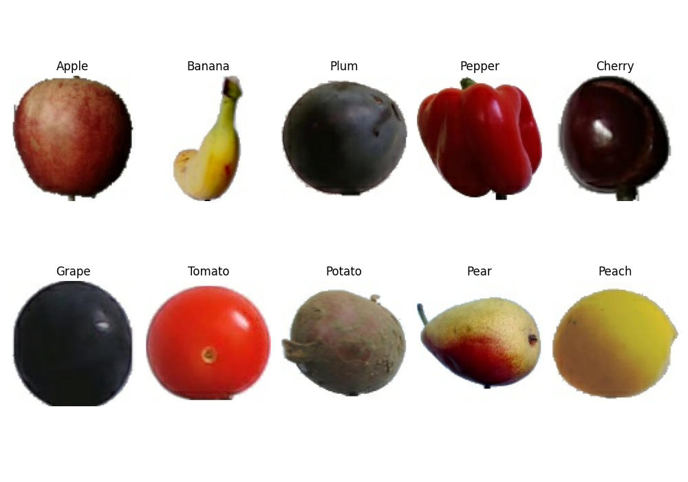

# Statistical Methods for Machine Learning
The [dataset](https://www.kaggle.com/moltean/fruits) is hosted by [kaggle.com](https://www.kaggle.com/) and it is not included in this repo. It is automatically downloaded from the code before. Before doing this, you must configure the kaggle's API by the following steps:

* make sure to have Python 3 installed and correctly configured
* install the kaggle API typing in console ```pip3 install kaggle```
* register to the kaggle website
* go to your personal account page and click the button "Create New API Token"
* the file downloaded in the previous step contains the credentials to login to the kaggle website: do not share with anyone
* copy this file in the path ```/home/{username}/.kaggle```

# Introduction

In the real world, there are a lot of different tasks that are too complicated to be modeled by a conventional algorithm. Some problems indeed may have a wide amount of data difficult to analyze. In this case, build a specific algorithm means to understand the complex patterns and the hidden correlations between the data. Instead, other tasks may be influenced by a lot of external factors that generate a large quantity of similar but different data. These factors are not easy to model, especially considered all together, and often they are not a priori known. This means that an algorithm performs well only in a controlled environment, that respects specific preconditions. On the other hand, if it is applied in the real world, the algorithm may encounter data that it cannot correctly analyze. A particular field of Computer Science is particularly suitable to solve these situations: machine learning (ML). It represents a family of algorithms that learn automatically through experience. These algorithms are not designed for a specific task but they are general purposes so they can be used to solve each type of task. The principle behind machine learning is the following: each real phenomenon can be modeled as an unknown mathematical function which can be approximate by a machine learning algorithm. In particular, they build a mathematical model based on sample data, known as training data, to make decisions or predictions without being explicitly programmed to do so. This means that the data play a central role in machine learning: they must be able to correctly define the model behind the task. First of all, they must be sufficient in number to generalize the problem, especially if the data have high dimensionality. Secondly, they must be well-formed, in terms of the range of values, scale, and distribution. Often a preprocessing procedure is necessary to modify the data before being used by a learning machine to improve its performance. There are three main approaches to machine learning, depending on the nature and the type of data available to a learning machine. The first is called *supervised learning* and consists in presenting to the learning model the inputs with the correct outputs. The goal is to learn a general function that maps inputs to outputs. Another machine learning technique is *unsupervised learning* where the input is not associated with labels, leaving to the learning machine the task of finding the data structure. Discovering the hidden patterns of data can be a goal itself or the purpose can be the generation of new data with similar characteristics. The last category is called *reinforcement learning* and occurs when a computer program interacts with a real environment in which it must perform a certain task. The leaning machine is provided by feedback which is analogous to rewards and it tries to maximize them, as it navigates the specific problem space. Machine learning algorithms are often used in computer vision tasks, like object classification, object detection, motion analysis, and many others. In the last few years, the state of the art methods to perform object classification use machine learning, in particular *deep learning.* Deep learning is based on artificial neural networks, inspired by the biological neural network that composed the animal brains. Specifically to computer vision, the convolutional neural networks (CNNs) are particularly suitable for analyzing images. They are able to learn how to extract the features using the convolutional layers and, subsequently, use these features in a space invariant way to better generalize the data. In this work, it is performed a multi-classification task over images. The aim is to demonstrate the effective validity of the CNNs for image classification compared with weakness models [**QUALI MODELLI**]..

# Dataset

The aim of this work is to evaluate the performances of deep networks in an image multi-classification task. The dataset consists into a wide series of images that depict different types of fruit and vegetable. It is downloadable by following this [link](https://www.kaggle.com/moltean/fruits). The dataset includes a lot fruit and vegetable types, but in this experiment only 10 of them are considered. They are *apple*, *banana*, *plum*, *pepper*, *cherry*, *grape*, *tomato*, *potato*, *pear* and *peach*. These are the ten classes that the learning machines will have to provide. In the dataset, each categories is divided in sub-group. For example, there exists a lot a different types of apple (apple Golden, apple Granny Smith, apple Pink Lady, etc) and with a different colors (yellow, red, green, etc). All varieties of each type of fruit or vegetable are grouped together in a single set. The figure below shows the ten categories.



